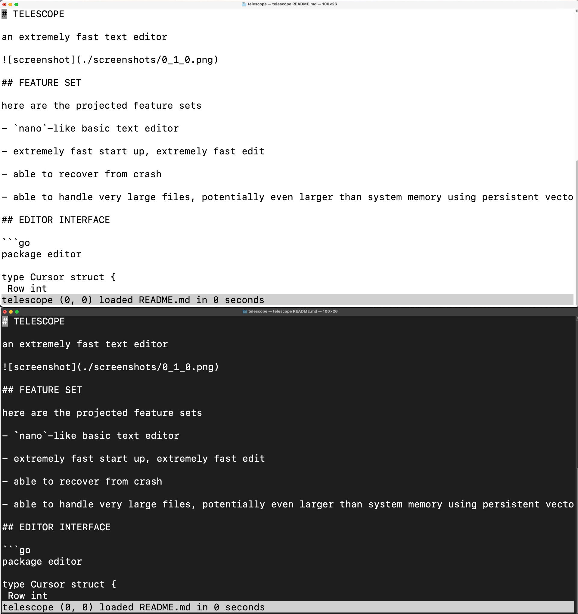

# TELESCOPE

an extremely fast text editor



## FEATURE SET

- basic text editor
    - navigate with `Left`, `Right`, `Up`, `Down`, `PgUp`, `PgDn`, `Home`, `End`
    - undo redo with `Ctrl+U`, `Ctrl+R`

- instant start-up, instant edit

- able to handle very large files, potentially even larger than system memory.

- able to recover from crash

- able to edit while still loading the file and exit without losing any progress

- vim-like command mode, search, goto line, etc.

## RELEASE MODEL

- initial release comes with no suffix, e.g. `0.1.7`

- bug fix releases come with suffix, e.g. `0.1.7a, 0.1.7b`

- the latest stable release should be one lower than latest releast with highest suffix. for example, if `0.1.7b` is the latest release, then `0.1.6z` is the stable release
 
## INTERACTION WITH FILE SYSTEM

0. use `telescope -h` for help

1. when user opens a file using `telescope inputfile`, the program will create a log file (journal file) stored at `<tmp>/telescope_log/<path>` where `<tmp>` is system default temporary folder

2. when user edit the file, every action will be written to log file.

3. when exit the program the log file is preserved to export

4. user can use command `:w outputfile` to write the current file into a new file, if `outputfile` is empty, it will overwrite the current file and exit

5. user use `telescope -r inputfile` to replay the log to make a new file. the program will write the output to stdout

## EDITOR

```go
package editor

import (
	"context"
	"telescope/util/buffer"
	"telescope/util/text"
)

type Object = map[string]any
type Position struct {
	Row int
	Col int
}

type Status struct {
	Message    string
	Background string
	Other      Object // arbitrary view
}

type Window struct {
	TopLeft   Position
	Dimension Position
}

type View struct {
	Text   text.Text
	Cursor Position
	Window Window
	Status Status
}

type Move interface {
	MoveLeft()
	MoveRight()
	MoveUp()
	MoveDown()
	MoveHome()
	MoveEnd()
	MovePageUp()
	MovePageDown()
	Goto(row int, col int)
}

type Edit interface {
	Type(ch rune)
	Backspace()
	Delete()
	Enter()
	Tabular()
	Undo()
	Redo()

	InsertLine(t2 text.Text)
	DeleteLine(count int)

	Apply(entry LogEntry)
}

type Render interface {
	Render() View
	Update() <-chan View
}

type Editor interface {
	Load(ctx context.Context, reader buffer.Reader) (context.Context, error)
	Escape()
	Resize(height int, width int)
	Status(update func(status Status) Status)
	Action(Object) // arbitrary action
	Subscribe(func(LogEntry)) uint64
	Unsubscribe(key uint64)
	Render
	Edit
	Move
}
type Command string

const (
  CommandSetVersion Command = "set_version" // set version of serializer
  CommandType       Command = "type"
  CommandEnter      Command = "enter"
  CommandBackspace  Command = "backspace"
  CommandDelete     Command = "delete"
  CommandUndo       Command = "undo"
  CommandRedo       Command = "redo"
  CommandInsertLine Command = "insert_line"
  CommandDeleteLine Command = "delete_line"
)

type LogEntry struct {
  Command Command  `json:"command"`
  Version uint64   `json:"version,omitempty"`
  Row     uint64   `json:"row,omitempty"`
  Col     uint64   `json:"col,omitempty"`
  Rune    rune     `json:"rune,omitempty"`
  Text    [][]rune `json:"text,omitempty"`
  Count   uint64   `json:"count,omitempty"`
  Beg     uint64   `json:"beg,omitempty"`
  End     uint64   `json:"end,omitempty"`
}
```